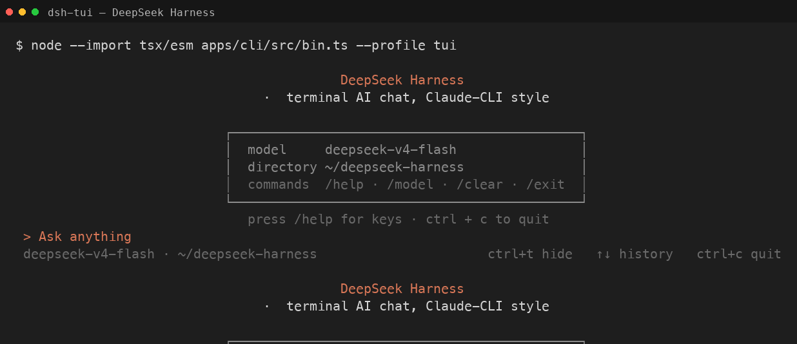

# dsh-tui

**Claude-CLI-style terminal chat for [DeepSeek Harness](https://github.com/deepseek-ai/deepseek-harness) (`dsh`) — a thin [Ink](https://github.com/vadimdemedes/ink) plugin installed via `dsh plugin`.**

`dsh-tui` is a publishable bundle-patch plugin. It disables the headless one-shot runner and inserts a `tui-runner` that renders an interactive, bottom-anchored streaming transcript over the dsh agent kernel. The kernel is untouched — tools, skills, subagents, todos, goal, plan, and workflow all run through the harness; the TUI only renders.



## Features

- **Claude-CLI-style UI**: bottom-anchored streaming transcript, `>` composer, folded tool-call cells.
- Collapsible thinking (`ctrl+t`), interruptible turns (`esc`), history recall (`↑`/`↓`), inline permission prompts.
- Terminal-theme-adaptive colors (light/dark, probed via OSC 11).
- Slash commands and CLI flags: `/help`, `/clear`, `/model`, `/status`, `/cost`, `/exit` — plus `--resume`, `--continue`, `--model`, `--list-sessions`.
- Everything else (`/compact`, `/goal`, `/plan`, `/permission`, `/feedback`, …) delegates to the harness's native command registry.

## Install

Requires Node.js ≥ 20 and the harness CLI on PATH (`npm install -g @deepseek-ai/dsh`).

**Path 1 — `npm i -g` (recommended):**

```bash
npm install -g @deepseek-ai/dsh    # the harness (skip if already installed)
npm install -g dsh-tui             # this plugin; provides the `dsh-tui` command
dsh-tui                            # auto-bootstraps the `tui` profile, then runs
```

**Path 2 — curl installer:**

```bash
curl -fsSL https://raw.githubusercontent.com/little-greenbean/dsh-tui/main/scripts/install.sh | sh
dsh --profile tui
```

Both are idempotent and safe to re-run. The profile composes `@deepseek-ai/dsh-base` + `@deepseek-ai/dsh-headless` + `dsh-tui`; the launcher/installer wire the in-box headless bundle for you.

## The `dsh-tui` launcher

The package ships a dependency-free `dsh-tui` bin that:

- ensures the `tui` profile exists, bootstrapping it on first run;
- then runs `dsh --profile tui`, passing through any extra arguments;
- exits 127 with an install hint if `dsh` is not on PATH.

```bash
dsh-tui                       # equivalent to: dsh --profile tui
dsh-tui --resume <id>         # resume a prior session
dsh-tui --continue            # resume the most recent session
dsh-tui --list-sessions       # list resumable sessions
```

## Usage

| Key | Action |
| --- | --- |
| `esc` | interrupt the current turn |
| `ctrl+t` | toggle thinking display |
| `↑` / `↓` | recall previous input history |
| `ctrl+c` | quit |

Slash commands typed in the composer: `/help`, `/clear`, `/model [name]`, `/status`, `/cost`, `/exit` (or `/quit`). Any other slash command is forwarded to the harness's native command registry and rendered in the transcript.

CLI flags (after `--profile tui` or passed through `dsh-tui`): `--resume <id>`, `--continue`/`-c`, `--model <name>`/`-m`, `--list-sessions`/`--ls`, `--help`/`-h`.

## Model & credentials

The TUI uses whatever model/provider the harness's `agent-default-model` resolves to — by default the DeepSeek official provider (`deepseek-official`) with model `deepseek-v4-flash`, overridable through the harness settings (e.g. `~/.dsh/settings.yaml`, or the Web UI). The API key is resolved through the harness's credential store: the `DEEPSEEK_API_KEY` environment variable, or `~/.dsh/.credentials.yaml` (mode 0600).

```bash
export DEEPSEEK_API_KEY=sk-...
dsh --profile tui
```

## Contributing

See [docs/ARCHITECTURE.md](docs/ARCHITECTURE.md) for the plugin/patch model and module graph, and [docs/PLAN.md](docs/PLAN.md) for the development plan. Run the unit tests with `npm test`.

## License

[MIT](LICENSE)

Integration reference: [gxinxing/deepseek-harness-tui](https://github.com/gxinxing/deepseek-harness-tui) (MIT).
